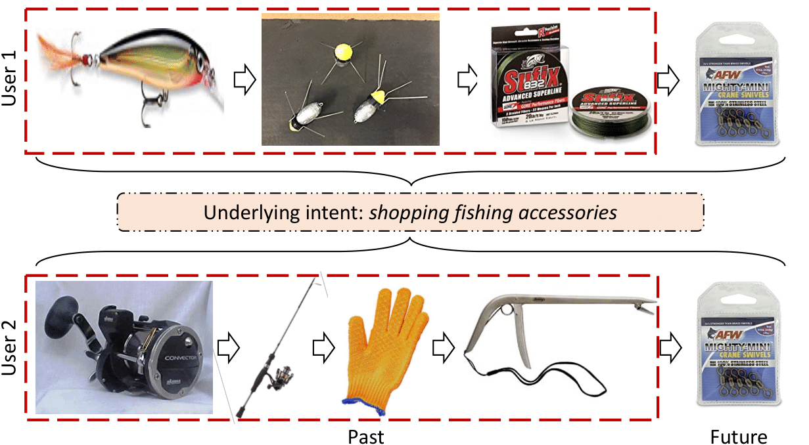
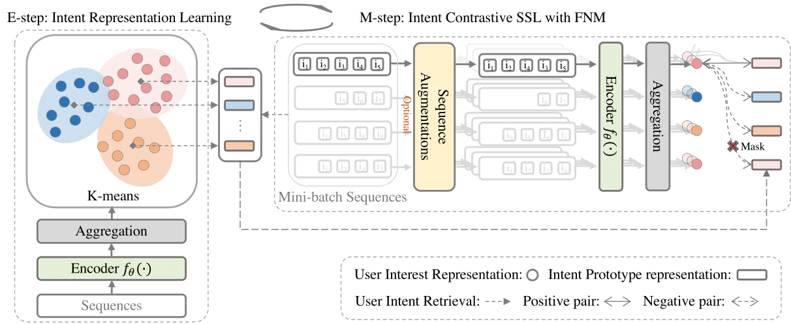

# Intent Contrastive Learning for Sequential Recommendation (ICLRec)

Source code for paper: [Intent Contrastive Learning for Sequential Recommendation](https://arxiv.org/pdf/2202.02519.pdf)

## Introduction

Motivation: 

Users' interactions with items are driven by various underlying intents. These intents are often unobservable while potentially beneficial to learn a better users' preferences toward massive item set.



Model Architecture:



## Reference

Please cite our paper if you use this code.

```
@article{chen2022intent,
  title={Intent Contrastive Learning for Sequential Recommendation},
  author={Chen, Yongjun and Liu, Zhiwei and Li, Jia and McAuley, Julian and Xiong, Caiming},
  journal={arXiv preprint arXiv:2202.02519},
  year={2022}
}
```

## Implementation
### Requirements

Python >= 3.7  
Pytorch >= 1.2.0  
tqdm == 4.26.0 
faiss-gpu==1.7.1

### Datasets

Four prepared datasets are included in `data` folder.


### Evaluate Model

We provide the trained models on Beauty, Sports_and_Games, Toys_and_Games, and Yelp datasets in `./src/output` folder. You can directly evaluate the trained models on test set by running:

```
python main.py --data_name <Data_name> --model_idx 1 --do_eval
```

You are expected following results:

On Beauty: 
```
{'Epoch': 0, 'HIT@5': '0.0500', 'NDCG@5': '0.0326', 'HIT@10': '0.0744', 'NDCG@10': '0.0403', 'HIT@20': '0.1058', 'NDCG@20': '0.0483'}
```
On Sports:
```
{'Epoch': 0, 'HIT@5': '0.0290', 'NDCG@5': '0.0191', 'HIT@10': '0.0437', 'NDCG@10': '0.0238', 'HIT@20': '0.0646', 'NDCG@20': '0.0291'}
```
On Toys:

```
{'Epoch': 0, 'HIT@5': '0.0598', 'NDCG@5': '0.0404', 'HIT@10': '0.0834', 'NDCG@10': '0.0480', 'HIT@20': '0.1138', 'NDCG@20': '0.0557'}
```

On Yelp:
```
{'Epoch': 0, 'HIT@5': '0.0240', 'NDCG@5': '0.0153', 'HIT@10': '0.0409', 'NDCG@10': '0.0207', 'HIT@20': '0.0659', 'NDCG@20': '0.0270'}
```

Please feel free to test is out!


### Train Model

To train ICLRec on a specific dataset, change to the `src` folder and run following command: 

```
bash scripts/run_<data_name>.sh
```

The script will automatically train ICLRec and save the best model found in validation set, and then evaluate on test set.


## Acknowledgment
 - Transformer and training pipeline are implemented based on [S3-Rec](https://github.com/RUCAIBox/CIKM2020-S3Rec). Thanks them for providing efficient implementation.

